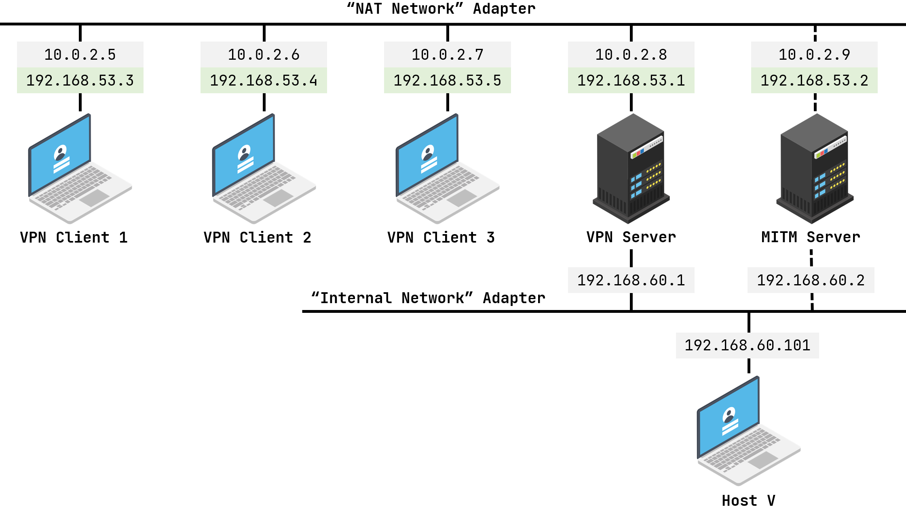

## 整体架构


*to xpl:这个图要重画，IP地址按照docker-compose.yml文件中的设置来*

注意：以下命令建议在root身份执行。用Makefile文件写了脚本，具体命令可见Makefile中

默认证书：
用户名：seed
密码：dees

## 创建证书
项目根目录下执行如下：
```
make all
```

注意，make all之前记得make clean一下，如果make clean报错没有对应文件，那就不用继续clean了


## docker启动
```
make up
```

## 开启服务端
make up之后会看到所有docker的信息，用以下命令启动对应docker

```
 docker exec -it <docker-name> bash
```

1. 打开vpn-server
2. 在server上运行vpnserver.py

## 开启服务端

1. 随机打开client的docker
2. 在client中运行对应的vpnclient.py

## 测试
两边都打开之后，如果在client1运行了python代码，在host docker中ping 10.0.3.5(client1)，即可ping 通，因为vpn server转发了，但如果client1端关闭，ping不通。

## docker关机
```
make down
```

## 项目清除
```
make clean
```


## 常见问题
1. 如果启动docker的时候发生如下问题：

    

    在docker-compose.yml文件中统一将`192.168.60`换成其他网段即可

2. 记得提前在Linux上下载好docker

## 指导手册

感谢这位佬的[手册](https://blog.csdn.net/qq_39678161/article/details/126627332)