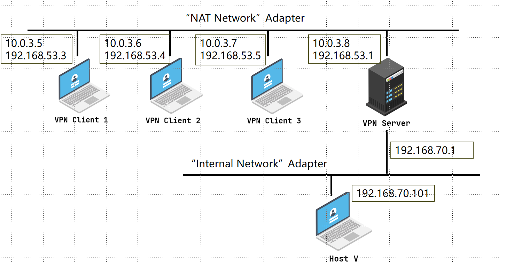

## 常用命令
关闭所有docker
docker stop $(docker ps -aq)

删除所有docker
docker rm $(docker ps -aq)

查看所有
docker ps -a

## 整体架构



注意：以下命令建议在root身份执行。用Makefile文件写了脚本，具体命令可见Makefile中

默认证书：

用户名：seed

密码：dees

## 代码目录
demoCA用来存证书相关的文件

volumes是和docker的共享文件夹

myCA_openssl.cnf是证书的配置文件

Makefile文件是自动化脚本，具体命令什么意思可以问chat

## 创建证书
项目根目录下执行如下：
```
make cert
```

注意，make cert之前记得make clean一下，如果make clean报错没有对应文件，那就不用继续clean了


## docker启动
```
make up
```

## 开启服务端
make up之后会看到所有docker的信息，用以下命令启动对应docker

```
 docker exec -it <docker-name> bash
```

1. 打开vpn-server
2. 在server上运行vpnserver.py

## 开启服务端

1. 随机打开client的docker
2. 在client中运行对应的vpnclient.py

## 测试
两边都打开之后，如果在client1运行了python代码，在host docker中ping 10.0.3.5(client1)，即可ping 通，因为vpn server转发了，但如果client1端关闭，ping不通。

server:


client1:


host ping结果：


## docker关机
```
make down
```

## 项目清除
```
make clean
```


## 常见问题
1. 如果启动docker的时候发生如下问题：

    

    在docker-compose.yml文件中统一将`192.168.60`换成其他网段即可

2. 记得提前在Linux上下载好docker

## 指导手册

感谢这位佬的[手册](https://blog.csdn.net/qq_39678161/article/details/126627332)


mkdir demoCA
cd demoCA
mkdir certs crl newcerts
touch index.txt serial
echo 1000 > serial
cd ..
cp /usr/lib/ssl/openssl.cnf myCA_openssl.cnf
openssl req -x509 -newkey rsa:4096 -sha256 -days 3650 -keyout ca.key -out ca.crt -subj "/CN=www.modelCA.com/O=Model CA LTD./C=CN/ST=NJ/L=SEU" -passout pass:dees
openssl req -newkey rsa:2048 -sha256 -keyout vpn.key -out vpn.csr -subj "/CN=vpnlabserver.com/O=Model CA LTD./C=CN/ST=NJ/L=SEU" -passout pass:dees
openssl ca -config myCA_openssl.cnf -policy policy_anything -md sha256 -days 3650 -in vpn.csr -out vpn.crt -batch -cert ca.crt -keyfile ca.key
mv ./vpn.crt ./volumes/server-certs/

mv ./ca* ./volumes/client-certs/
cd volumes/client-certs/
openssl x509 -in ca.crt -noout -subject_hash
ln -s ca.crt 112bc731.0


